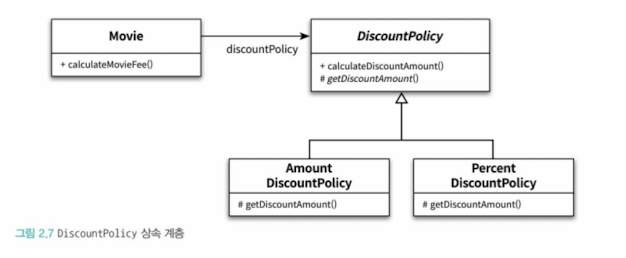

# IntelliJ Settings

* [Editor > General > Inline Completion](intellij-settings.md#editor-greater-than-general-greater-than-inline-completion)
* [Build, Execution, Deployment > Compiler > Annotation Processors](intellij-settings.md#build-execution-deployment-greater-than-compiler-greater-than-annotation-processors)

***

## Editor > General > Inline Completion

2024.3 으로 업데이트를 하면 Code Completion에 대한 설정을 하라고 팝업이 뜬다.

<figure><figcaption>
학습을 위해 AI Local로 설정
</figcaption></figure>

<figure><figcaption>
unchecked
</figcaption></figure>

## Build, Execution, Deployment > Compiler > Annotation Processors

<figure><figcaption>
annotation processor
</figcaption></figure>

