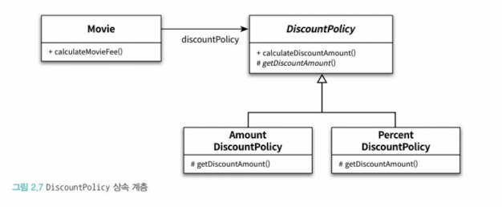

# 2장

## 객체지향 프로그래밍을 향해

### 협력, 객체, 클래스

클래스가 아닌 객체에 초점을 맞춘다. 이를 위해서 다음 두 가지에 집중해야 한다.

1. 어떤 클래스가 필요한지 고민하기 전에 어떤 객체들이 필요한지 고민한다.
   1. 클래스는 공통적인 상태와 행도을 공유하는 객체들을 추상화 한 것이다.
   2. 클래스의 윤곽을 잡기 위해서는 어떤 객체들이 어떤 상태와 행동을 갖는지를 먼저 정해야 한다.
2. 객체를 독립적인 존재가 아니라 기능을 구현하기 위해 협력하는 공동체의 일원으로 봐야한다.
   1. 공통된 특성과 상태를 가진 객체들을 타입으로 분류하고 이 타입을 기반으로 클래스를 구현하자.

### 도메인의 구조를 따르는 프로그램 구조

소프트웨어는 사용자가 어떤 문제를 해결하기 위해 만들어진다. 문제를 해결하기 위해 사용자가 프로그램을 사용하는 분야를 도메인 이라고 부른다.

#### 원칙

* 클래스의 이름은 대응되는 도메인 개념의 이름과 동일하거나 적어도 유사하게 지어야 한다.
* 클래스 사이의 관계도 최대한 도메인 개념 사이에 맺어진 관계와 유사하게 만들어서 프로그램의 구조를 이해하고 예상하기 쉽게 만들어야 한다.

### 클래스 구현하기

다른 개발자에 의해 개발된 클래스를 사용할 때 가장 중요한 것은 클래스의 경계를 구분 짓는 것이다. 클래스는 내부와 외부로 구분되며 훌륭한 클래스를 설계하기 위한 핵심은 어떤 부분을 외부에 공개하고 어떤 부분을 감출지를 결정하는 것이다.

이렇게 하는 이유는 경계의 명확성이 객체의 자율성을 보장하기 때문이다. 그리고 더 중요한 이유는 프로그래머에게 구현의 자유를 제공하기 때문이다.

#### 자율적인 객체

중요한 사실 2가지

* 객체는 **상태(state)와 행동(behavior)**&#xC744; 함께 갖는다.
* 객체는 스스로 판단하고 행동하는 자율적인 존재이다.
  * 자율적인 존재가 되려면 객체 내부에 대한 접근을 통제 해야 한다.
  * 자율적인 존재가 되기 위해서는 외부의 간섭을 최소화 해야 한다.
    * 외부에서 객체가 어떤 상태에 놓여 있는지, 어떤 생각을 하고 있는지 알아서는 안되며, 결정에 직접적으로 개입하려고 해서도 안된다.
    * **객체에게 원하는 것을 요청하고 그 객체 스스로가 결정해야 한다는 것이다.**

객체지향 이전의 패러다임은 서로 독립적인 존재인 기능과 데이터를 서로 엮어 프로그램을 구성하였지만 객체지향은 객체 단위 안에 데이터와 기능을 하나 덩어리로 묶음으로써 문제 영역의 아이디어를 표현할 수 있게 했다. 이 처럼 데이터와 기능을 객체 내부로 함께 묶는 것을 **캡슐화**라고 부른다. 자바는 캡슐화 하는 것에 더 나아가 **접근 제어(access control)와 접근 수정자(access modifier)**&#xB97C; 제공한다.

캡슐화와 접근제어는 객체를 두 부분으로 나눈다.

* 외부에서 접근가능한 public interface
* 내부에서만 접근 가능한 구현(implementation)

이 두 가지를 지키는 원칙이 인터페이스와 구현의 분리 원칙(separation of interface and implementation)이다.

#### 프로그래머의 자유

> _프로그래머의 역할을 클래스 작성자(class creator) 클라이언트 프로그래머(client programmer)로 구분하는 것이 유용하다(Eckel06) - Thinking in Java_

클래스 작성자는 클라이언트 프로그래머가 숨겨놓은 부분에 마음대로 접근 할 수 없도록 방지하도록 해야한다. 이를 **구현 은닉(implementation hiding)** 이라고 부른다. 구현 은닉을 가능하게 해주는 것이 접근 제어 메커니즘이다. private에 접근을 시도하면 컴파일 오류를 뱉는 것이다.

구현 은닉을 함으로써 클래스 작성자와 클라이언트 프로그래머 모두에게 유용해 진다.

* 클래스 작성자는 클라이언트 프로그래머에 대한 영향을 걱정하지 않고 내부 구현을 마음대로 변경할 수 있고
* 클라이언트 프로그래머는 내부의 구현은 무시한 채 인터페이스만 알고 있어도 클래스를 사용할 수 있다.

설계가 필요한 이유는 변경을 관리하기 위해서라는 것을 기억하자. 변경을 관리하는 방법 중 하나가 **접근 제어**다.

### 협력하는 객체들의 공동체, 협력에 관한 짧은 이야기

* 객체지향의 장점은 객체를 이용해서 도메인의 의미를 풍부하게 표현할 수 있다는 것.
* 비록 인스턴스 변수가 하나일지라도 도메인 의미가 좀 더 명시적이고 분명하게 표현할 수 있다면 객체를 사용하는 것이 좋다.
* 객체는 다른 객체의 인터페이스를 통해 행동을 수행도록 요청(request)할 수 있다.
  * 객체가 다른 객체와 상호작용 할 수 있는 유일한 방법은 메시지를 전송(send a message)하는 것 뿐이다.
  * 다른 객체에게 요청이 도착할 때 해당 객체가 메시지를 수신(receive a message) 했다고 이야기 한다.
    * 수신된 메시지를 처리하기 위한 자신만의 방법을 메서드(method)라고 부른다.
      * 메시지(message)와 메서드를 구분해야 한다.
* 요청을 받은 객체는 자율적인 방법에 따라 요청을 처리한 후 응답(response)한다.

## 할인 요금 구하기

* 템플릿 메서드 패턴

```java
// 추상 클래스: 템플릿 메서드를 포함
abstract class CaffeineBeverage {
    // 템플릿 메서드: 음료를 준비하는 과정
    public final void prepareRecipe() {
        boilWater();
        brew();
        pourInCup();
        addCondiments();
    }

    // 서브클래스가 구현해야 하는 추상 메서드
    abstract void brew();
    abstract void addCondiments();

    // 공통 메서드 (변하지 않는 부분)
    private void boilWater() {
        System.out.println("물을 끓입니다.");
    }

    private void pourInCup() {
        System.out.println("컵에 따릅니다.");
    }
}

// 구체 클래스: 커피 만들기
class Coffee extends CaffeineBeverage {
    @Override
    void brew() {
        System.out.println("커피를 내립니다.");
    }

    @Override
    void addCondiments() {
        System.out.println("설탕과 우유를 추가합니다.");
    }
}

// 구체 클래스: 차 만들기
class Tea extends CaffeineBeverage {
    @Override
    void brew() {
        System.out.println("찻잎을 우려냅니다.");
    }

    @Override
    void addCondiments() {
        System.out.println("레몬을 추가합니다.");
    }
}

// 실행 클래스
public class TemplateMethodPatternExample {
    public static void main(String[] args) {
        System.out.println("커피 준비 중...");
        CaffeineBeverage coffee = new Coffee();
        coffee.prepareRecipe();

        System.out.println("\\n차 준비 중...");
        CaffeineBeverage tea = new Tea();
        tea.prepareRecipe();
    }
}
```

* 오버라이딩과 오버로딩

## 상속과 다형성

<figure><figcaption></figcaption></figure>

다이어그램을 보면 Movie는 DiscountPolicy와 연결돼 있으며 AmountDiscountPolicy, PercentDiscountPolicy는 DiscountPolicy를 상속받는다. 이처럼 어떤 클래스가 다른 클래스에 접근할 수 있는 경로를 가지거나 해당 클래스의 객체의 메서드를 호출할 경우 두 클래스 사이의 **의존성이 존재한다고 말한다**.

<figure><figcaption></figcaption></figure>

여기서 DiscountPolicy는 추상 클래스인데 코드를 봤을때 Movie는 AmountDiscountPolicy, PercentDiscountPolicy 이 두 인스턴스에 대해서는 알지 못한다는 점이다.

<figure><figcaption></figcaption></figure>

다만 Movie를 생성할 때에 인자로 넘겨주는 상황에서는 두 인스턴스에 대해 알 수 있다. 즉, 여기서 말하고자 하는 것은 다이어그램의 나와있는 의존성 즉 코드 의존성과 실행 시점의 의존성이 서로 다를 수 있다는 것이다. 다시 말해 클래스 사이의 의존성과 객체 사이의 의존성은 동일하지 않을 수 있다. 확장 가능한 객체지향 설계가 가지는 특징은 코드의 의존성과 실행 시점의 의존성이 다르다는 것이다.

코드의 의존성과 실행 시점의 의존성이 다를수록 코드를 이해하기 어려워진다는 것이다. 코드를 이해하기 위해서는 코드뿐만 아니라 객체를 생성하고 연결하는 부분을 찾아야 하기 때문이다. 이와 반면에 코드의 의존성과 실행 시점의 의존성이 다를 수록 코드는 더 유연해지고 확장 가능해진다. **이와 같은 의존성의 양면성은 설계가 트레이드오프의 산물이라는 사실을 잘 보여준다.**

### 차이에 의한 프로그래밍

상속은 객체지향에서 코드를 재사용하기 위해 가장 널리 사용하는 방법이다. 상속을 이용하면 클래스 사이에 관계를 설정하는 것만으로 기존 클래스가 가지고 있는 모든 속성과 행동을 새로운 클래스에 포함 시킬 수 있다. 상속을 이용하면 부모 클래스의 구현은 공유하면서 행동이 다른 자식 클래스를 쉽게 추가 할 수 있다. 위의 코드에서 AmountDiscountPolicy, PercentDiscountPolicy 클래스가 그 예이다. 이 두 클래스는 부모에서 정의한 추상 메서드를 오버라이딩 해서 DiscountPolicy의 행동을 수정한다는 것을 알 수 있다. 이러한 방법을 차이에 의한 프로그래밍(programming by diffrence) 이라고 부른다.

### 상속과 인터페이스

대부분의 사람들은 상속의 목적이 메서드나 인스턴스 변수를 재사용하는 것이라고 생각한다. 순수하게 코드를 재사용하기 위한 목적으로 상속을 사용하는 것을 구현 상속(implementation inheritance)이라고 한다. 인터페이스를 재사용할 목적이 아닌 구현을 재사용할 목적으로 상속을 사용하면 변경에 취약한 코드를 낳게 될 확률이 높다.

인터페이스는 객체가 이해할 수 있는 메시지의 목록을 정의한다. 상속을 통해 자식 클래스는 자신의 인터페이스 목록에 부모 클래스의 인터페이스를 포함하게 된다. 결과적으로 자식 클래스는 부모 클래스가 수신할 수 있는 모든 메시지를 수신할 수 있기 때문에 외부 객체는 자식 클래스를 부모 객체 클래스와 동일한 타입으로 간주할 수 있다.

<figure><figcaption></figcaption></figure>

<figure><figcaption></figcaption></figure>

Movie는 calculateMovieFee 메시지를 수신할 수 있도록 public 인터페이스로 열어놓았고, 그걸 다시 DiscountPolicy의 calculateDiscountAmount 메시지를 전송하고 있다. 여기서 중요한 것은 Movie 입장에서는 자신과 협력하는 객체가 어떤 클래스의 인스턴스인지 중요한게 아니라, DiscountPolicy 객체가 calculateDiscountAmount라는 메시지를 수신할 수 있다는 사실이 중요하지, 그 객체가 어떤 클래스의 인스턴스 인지는 중요하지 않다.

정리하면 자식 클래스는 상속을 통해 부모 클래스의 인터페이스를 물려 받기 때문에 컴파일러 코드상에서 부모 클래스가 나오는 모든 장소에서 자식 클래스를 사용하는 것을 허락한다. 그래서 Movie 생성자의 인자타입으로 AmountDiscountPolicy, PercentDiscountPolicy 를 받을 수 있는 것이다. 이처럼 자식 클래스가 부모 클래스를 대신 하는 것을 **업캐스팅(upcasting)**&#xC774;라고 한다.

### 다형성

* 다형성은 객체지향 프로그램의 컴파일 시간 의존성과 실행 시간 의존성이 다를 수 있다는 사실을 기반으로 한다
* 동일한 메시지를 수신했을 때 객체의 타입에 따라 다르게 응답할 수 있는 능력을 의미한다.
  * 따라서 다형적인 협력에 참여하는 객체들은 모두 같은 메시지를 이해할 수 있어야 한다. 즉, 인터페이스가 동일한 것이다.
* 다형성을 구현하는 방법은 매우 다양하지만 메시지에 응답하기 위해 실행될 메서드를 컴파일 시점이 아닌 실행 시점에 결정한다는 공통점이 있다.
  * 다시 말해 메시지와 메서드를 실행 시점에 바인딩한다는 것이다. 이를 지연 바인딩(lazy binding) 또는 동적 바인딩(dynamic binding)이라고 한다.
  * 그에 반해 컴파일 시점에 실행될 함수나 프로시저를 결정하는 것을 초기 바인딩(early binding) 또는 정적 바인딩(static binding)이라고 한다.
* 상속을 이용하면 동일한 인터페이스를 공유하는 클래스들을 하나의 타입 계층으로 묶을 수 있다.

<figure><figcaption></figcaption></figure>

### 인터페이스와 다형성

구현은 공유할 필요가 없고 순수하게 인터페이스만 공유하고 싶을 때가 있다. 자바에서는 이를 interface 키워드를 이용해서 클래스를 선언할 수 있다. 인터페이스를 구현한 클래스들은 동일한 인터페이스 메서드를 공유하며 이 경우에도 업캐스팅이 적용되며 협력은 다형적이다.

<figure><figcaption></figcaption></figure>

## 추상화와 유연성

### 추상화의 힘

* 추상화를 사용하면 세부적인 내용을 무시한 채 상위 정책을 간단하게 표현할 수 있다.
* 추상화를 이용하여 상위 정책을 표현하면 기존 구조를 수정하지 않고도 새로운 기능을 쉽게 추가하고 확장할 수 있다.

### 추상 클래스와 인터페이스 트레이드 오프

구현과 관련된 모든 것들이 트레이드오프의 대상이 될 수 있다는 사실을 기억하자. **우리가 작성하는 모든 코드에는 합당한 이유가 있어야 한다.** 비록 아주 사소한 결정이더라도 트레이드오프를 통해 얻어진 결론과 그렇지 않은 결론 사이의 차이는 크다.

### 코드 재사용

상속은 코드를 재사용하기 위해 널리 사용되는 방법이다. 하지만 상속 보다는 **합성(composition)**&#xC774; 더 좋은 방법이라는 이야기를 많이 들었을 것이다. 합성은 다른 객체의 인스턴스를 자신의 인스턴스 변수로 포함해서 재사용하는 방법이다. Movie가 DiscountPolicy의 코드를 재사용하는 방법이 바로 합성이다.

<figure><figcaption></figcaption></figure>

Movie는 생성자를 통해 DiscountPolicy를 필드에 추가할 수 있다.

<figure><figcaption></figcaption></figure>

이를 상속으로도 구현할 수 있다. 하지만 왜 사람들은 상속 대신 합성을 더 선호할까?

### 상속

상속은 두 가지 관점에서 설계에 안 좋은 영향을 끼친다.

* 상속은 캡슐화를 위반 한다.
* 설계를 유연하지 못하게 한다.

첫번째 이유는 상속을 이용하기 위해서는 부모 클래스의 내부 구조를 잘 알고 있어야 한다. Movie를 상속으로 구현하는 것을 예로 들자면, Movie를 구현하려는 자식 클래스에서는 calculateMovieFee 에서 getDiscountAmount 메서드를 호출한다는 사실을 알고 있어야 한다. 이는 부모 클래스의 구현이 자식 클래스에게 노출 되기 때문에 캡슐화가 약화 된다. 캡슐화의 약화는 자식 클래스가 부모 클래스에 강하게 결합되도록 만들기 때문에 부모 클래스를 변경할 때 자식 클래스도 함께 변경된 확률이 높다. 결과적으로 상속을 과도하게 사용한 코드는 변경하기도 어려워 진다.

두번째 이유는 설계가 유연하지 않다는 것이다. 상속은 부모 클래스와 자식 클래스 사이의 관계를 컴파일 시점에 결정한다. 따라서 실행 시점에 객체의 종류를 변경하는 것이 불가능하다.

### 합성

합성은 상속이 가지는 두 가지 문제점을 모두 해결한다. 인터페이스에 정의된 메시지를 통해서만 재사용이 가능하기 때문에 구현을 효과적으로 캡슐화 할 수 있다. 또한 의존하는 인스턴스를 교체하는 것이 비교적 쉽기 때문에 설계를 유연하게 만든다.

그렇다고 상속을 사용하지 말자는 것이 아니다. 대부분의 설계에서는 상속과 합성을 함께 사용해야 한다.
